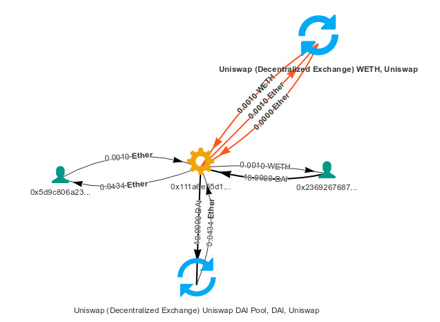

# AirSwap Trade transaction examined

__AirSwap__ [launched the "__Airswap Trader__"](https://medium.com/fluidity/introducing-airswap-trader-63a0ef9e67c0) service recently.
Public beta: https://trader.airswap.io/

The service allows sharing and settling over-the-counter (OTC) decentralized pair-to-pair trades in ERC20 tokens.

This article provides __technical info__ for one of the first trades:
- data published on the IPFS
- logs (trace) of the transactions on the Ethereum network
- transactions visualization

The info provided for __educational purposes__.

### The Order
AirSwap Trader Web-inteface:
https://trader.airswap.io/QmbZ92uP4SZEyEfQkqphiev6PGyuMFHynG1BSnoofhAhgM


The Oder data is published on the IPFS:
https://ipfs.infura.io/ipfs/QmbZ92uP4SZEyEfQkqphiev6PGyuMFHynG1BSnoofhAhgM
```
{
  "type":"SIGN_SWAP",
  "makerToken":"0x89d24a6b4ccb1b6faa2625fe562bdd9a23260359",    // DAI_token_contract
  "takerToken":"0xc02aaa39b223fe8d0a0e5c4f27ead9083c756cc2",    // WETH_token_contract
  "makerParam":"10000000000000000000",                          // 10 DAI
  "takerParam":"1000000000000000",                              // 0.1 WETH
  "makerWallet":"0x2369267687a84ac7b494dae2f1542c40e37f4455",   // Maker_wallet
  "takerWallet":"0x0000000000000000000000000000000000000000",   // anyone can take
  "expiry":1565189141,                                          // Aug-07-2019 02:45:41 PM +UTC
  "nonce": 1565185541946,                                       // probably: created on Aug-07-2019 01:45:41 PM +UTC
  "version":"0x01",
  "signer":"0x2369267687a84ac7b494dae2f1542c40e37f4455",        // Maker_wallet
  "r":"0xa3d1abbb5f6016e59b772b97e07634c3269225d60f596213d97bf2cac27a5e8e",
  "s":"0x4b58fa6204eb5ef7782d1abeedb50c844a05a61abe17dd2771baf9cb3c8b333f",
  "v":27
}
```
Maker sent: 10 DAI
Maker received: 0.001 WETH

### Addresses involved
Address                                   | Nickname in logs
------------------------------------------|----------------------
0x5d9c806a23830d6fd39e22b7d416a7a7a3a314bc| Taker_wallet
0x2369267687a84ac7b494dae2f1542c40e37f4455| Maker_wallet
0x1550d41be3651686e1aeeea073d8d403d0bd2e30| Some_wallet
0x111a6e55d1be9e57dd75c113dc00f3527b238724| The_trade_contract
0x9af9c0cf3cd15e0afe63930fbf20941c89f3ff98| Swap_trader_contract
0x6e1699545FA5dFcc4eF892c95aC7E38dcf9665a4| Swap_trader_library
0x8fd3121013a07c57f0d69646e86e7a4880b467b7| AirSwap_exch_contract
0xc02aaa39b223fe8d0a0e5c4f27ead9083c756cc2| WETH_token_contract
0x89d24a6b4ccb1b6faa2625fe562bdd9a23260359| DAI_token_contract
0x09cabEC1eAd1c0Ba254B09efb3EE13841712bE14| Uniswap_DAI_contract
0xA2881A90Bf33F03E7a3f803765Cd2ED5c8928dFb| Uniswap_WETH_contract
0x2157a7894439191e520825fe9399ab8655e0f708| Uniswap_Vyper_contract

### Order_taking_transaction
> Transaction Hash: 0x2313a07a525de5667f35a5ebfe07bff68831dc35b5aa0f45fd7908edb2dc0f82
  Block: 8303888
  Timestamp: Aug-07-2019 01:47:30 PM +UTC
  From: Taker_wallet
  Value: 0.001003244508086902 Ether ($0.23)
  Transaction Fee: 0.00153071400025 ETH ($0.34)
  Gas Used: 255,119

__Transfers and calls triggered by the Order_taking_transaction__\
\
_image source: [bloxy.info](https://bloxy.info/tx/0x2313a07a525de5667f35a5ebfe07bff68831dc35b5aa0f45fd7908edb2dc0f82#)_

```
Taker_wallet sends Order_taking_transaction that
|
+-creates The_trade_contract transferring 0.001003244508086902 ETH from Taker_wallet to The_trade_contract
  |
  +-The_trade_contract (running its constructor)
    |
    +-calls Uniswap_WETH_contract.ethToTokenSwapOutput ( tokens_bought: 1000000000000000, deadline: 1565189226 )
    | transferring 0.001003244508086902ETH from The_trade_contract to Uniswap_WETH_contract
    | |
    | +-Uniswap_WETH_contract.ethToTokenSwapOutput delegates call to Uniswap_Vyper_contract
    |   +-Uniswap_Vyper_contract code (on behalf of Uniswap_WETH_contract)
    |     |-calls WETH_token_contract.balanceOf ( who: Uniswap_WETH_contract ) for Token WETH
    |     |-transfers 0.000001003244508086 ETH from Uniswap_WETH_contract to The_trade_contract
    |     +-calls WETH_token_contract.transfer ( to: The_trade_contract, value: 1000000000000000 )
    |
    +-calls WETH_token_contract.approve ( spender: Swap_trader_contract, value: 1000000000000000 )
    |
    +-calls Swap_trader_contract.swap that
    |  +-delegates (one) call to Swap_trader_library    // Swap_trader_contract.isValid calls Types.hashOrder
    |  +-calls WETH_token_contract.transferFrom ( from: The_trade_contract, to: Maker_wallet, value: 1000000000000000 )
    |  +-calls  DAI_token_contract.transferFrom ( from: Maker_wallet, to: The_trade_contract, value: 10000000000000000000 )
    |     // notes: Maker_wallet approved the DAI transfer in adnavce by the "Maker_approval_transaction" (?)
    |     //        Maker_wallet acquired the DAI tokens by the "Maker_funding_transaction" (?)
    |
    +-calls DAI_token_contract.approve ( spender: Uniswap_DAI_contract, value: 10000000000000000000 )
    |
    +-calls Uniswap_DAI_contract.tokenToEthSwapInput ( tokens_sold: 10000000000000000000, min_eth: 43404413472519736,deadline: 1565189226 )
    | +-Uniswap_DAI_contract.tokenToEthSwapInput delegates call to Uniswap_Vyper_contract
    |   +-code of Uniswap_Vyper_contract (on behalf of Uniswap_DAI_contract)
    |     +-calls DAI_token_contract.balanceOf ( who: Uniswap_DAI_contract )
    |     +-transfers 0.043447861333853595 ETH from Uniswap_DAI_contract to The_trade_contract
    |     +-calls DAI_token_contract.transferFrom ( from: The_trade_contract, to: Uniswap_DAI_contract, value: 10000000000000000000 )
    |
    +-suicides with refund 0.04344886457836168 ETH to Taker_wallet

```
__Transfers triggered by the Order_taking_transaction__\
\
_image source: [bloxy.info](https://bloxy.info/tx/0x2313a07a525de5667f35a5ebfe07bff68831dc35b5aa0f45fd7908edb2dc0f82#)_

__Resulted in transfers:__

From                 | To                  | Value, token
---------------------|---------------------|------------------------:
Taker_wallet         |The_trade_contract   | 0.001003244508086902 ETH
The_trade_contract   |Uniswap_WETH_contract| 0.001003244508086902 ETH
Uniswap_WETH_contract|The_trade_contract   | 0.000001003244508086 ETH
Uniswap_DAI_contract |The_trade_contract   | 0.043447861333853594 ETH
The_trade_contract   |Taker_wallet         | 0.04344886457836168  ETH
Uniswap_WETH_contract|The_trade_contract   | 0.001               WETH
The_trade_contract   |Maker_wallet         | 0.001               WETH
Maker_wallet         |The_trade_contract   | 10.0                 DAI
The_trade_contract   |Uniswap_DAI_contract | 10.0                 DAI

### Related transactions

#### Maker_approval_transaction
> Transaction Hash: 0x69558242be38e4dbfb4204528d3be732bb48e1f02654cec5c3210d29b399a2ed
  Block: 8298865
  Timestamp: Aug-06-2019 07:09:39 PM +UTC
  From: Maker_wallet
  To: DAI_token_contract
  Value: 0 ETH
  Transaction Fee: 0.000277062 ETH
  Gas Used: 46,177
```
Maker_wallet calls DAI_token_contract.approve ( spender: Swap_trader_contract, value: 90071992547409910000000000 )
```

#### Maker_funding_transaction
> Transaction Hash: 0x013a517fd7d5b88645f7de2a83112d69d05ce7cf74be8f934545f465c6463fb1
  Block: 8303883
  Timestamp: Aug-07-2019 01:44:56 PM +UTC
  From: Maker_wallet
  To: AirSwap_exch_contract
  Value: 0.043548430164464009 ETH
  Transaction Fee: 0.000529265 ETH ($0.12)
  Gas Used: 105,853

```
// Note: the "maker" under this order is "Some_wallet" while the "taker" is Maker_wallet

Maker_wallet calls AirSwap_exch_contract.fill (
    makerAddress: Some_wallet , makerAmount: 10000000000000000000 , makerToken: DAI_token_contract ,
    takerAddress: Maker_wallet , takerAmount: 43548430164464009 , takerToken: 00000000000000000... ,
    expiration: 1565185649, nonce: 67920605,
    // signature of the above params made by Some_wallet
    v: 28 , r: ["4010cc1bcf300117c9d8b4146d9386dd8e0e0add308c2185a5938b0caae882e4"] , s: ["..."]
  ) transferring 0.04354843016446401 ETH from Maker_wallet to AirSwap_exch_contract
  |
  +-AirSwap_exch_contract.fill
    +-calls DAI_token_contract.transferFrom ( from: Some_wallet , to: Maker_wallet , value: 10000000000000000000 )
    +-transfers 0.04354843016446401ETH to Some_wallet
```

__Resulted in transfers__:

 From                | To                  | Value, token
---------------------|---------------------|-----------------------:
Maker_wallet         |AirSwap_exch_contract|0.04354843016446401  ETH
AirSwap_exch_contract|Some_wallet          |0.043548430164464009 ETH
Some_wallet          |Maker_wallet         |10.0                 DAI

### Notes on contracts

#### Contract "The_trade_contract"
```
Address: 0x111a6e55d1be9e57dd75c113dc00f3527b238724
Created by:
  Address: Taker_wallet
  Transaction: Order_order_taking_transaction
Self Destruct called at:
  Transaction: Order_order_taking_transaction
```
#### Contract Uniswap_DAI_contract
```
Address: 0x09cabEC1eAd1c0Ba254B09efb3EE13841712bE14
TokenTracker: Uniswap V1 (UNI-V1)
```
#### Contract Uniswap_WETH_contract
```
Address: 0xA2881A90Bf33F03E7a3f803765Cd2ED5c8928dFb
TokenTracker: Uniswap V1 (UNI-V1)
```
#### Contract "Swap_trader_contract"
```
Address: 0x9af9c0cf3cd15e0afe63930fbf20941c89f3ff98
// Swap (Trader) by Swap Holdings Ltd.
// File: contracts/Swap.sol
// @title Swap: The Atomic Swap used by the Swap Protocol
// contract Swap is ISwap {...

    /**
      * @notice Atomic Token Swap
      * @param _order Types.Order
      * @param _signature Types.Signature
      */
    function swap(
        Types.Order calldata _order,
        Types.Signature calldata _signature
    )
    external
        ...
        // Validate the maker side of the trade.
        if (_signature.v == 0) {
            /**
              * Signature is not provided. The maker may have authorized the sender
              * to swap on its behalf, which does not require a _signature.
              */
            require(isAuthorized(_order.maker.wallet, msg.sender), "SIGNER_UNAUTHORIZED");

        } else {
            /**
              * The signature is provided. Determine whether the signer is
              * authorized by the maker and if so validate the signature itself.
              */
            require(isAuthorized(_order.maker.wallet, _signature.signer),
                "SIGNER_UNAUTHORIZED");

            // Ensure the signature is valid.
            require(isValid(_order, _signature, domainSeparator), "SIGNATURE_INVALID");
        }

        // Transfer token from taker to maker.
        ...
        // Transfer token from maker to taker.
        ...

    /**
      * @notice Determine whether a delegate is authorized
      * @param _approver address
      * @param _delegate address
      * @return bool returns whether a delegate is authorized
      */
    function isAuthorized(
        address _approver,
        address _delegate
    ) internal view returns (bool) {
        if (_approver == _delegate) return true;
        return (delegateApprovals[_approver][_delegate] > block.timestamp);
    }

--- Contract AirSwap_exch_contract
Address: 0x8fd3121013a07c57f0d69646e86e7a4880b467b7
// See the Github at https://github.com/airswap/contracts
//   @title: AirSwap exchange contract.
//   Assumes makers and takers have approved this contract to access their balances.

    /** Fills an order by transferring tokens between (maker or escrow) and taker.
      * maker is given tokenA to taker,
      */
    function fill(address makerAddress, uint makerAmount, address makerToken,
                  address takerAddress, uint takerAmount, address takerToken,
                  uint256 expiration, uint256 nonce, uint8 v, bytes32 r, bytes32 s) payable {
```
